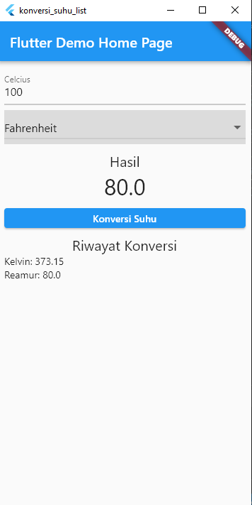

# TUGAS STATEFULL WIDGET AND MAP

NAMA : MILA YUNITA  
KELAS/ABSEN : TI-3C/13  
MATA KULIAH : PEMOGRAMAN MOBILE

## HASIL OUTPUT
1. Konversi dari Celcius ke Kelvin  
    
2. Konversi dari Celcius ke Reamur  
    
3. Konversi dari Celcius ke Fahrenheit 
    